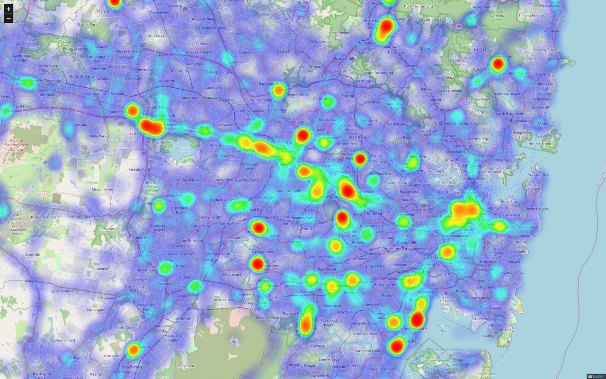

<div align="center">
  <h2>Waze Heatmap</h2>
  
  <p>Figure 1: Police reports in Sydney, Australia</p>
</div>

### Dependencies
- [NodeJS](https://nodejs.org/en) and [NPM](https://nodejs.org/en) (Latest)
- [Rust](https://www.rust-lang.org/) and [Cargo](https://www.rust-lang.org/)

Server (Rust/Cargo)
  - [Diesel](https://diesel.rs/guides/getting-started.html) (Dependencies required, see below)

> By default diesel CLI depends on the following client libraries:
>- **libpq** for the PostgreSQL backend
>- **libmysqlclient** for the Mysql backend
>- **libsqlite3** for the SQLite backend


### Setup
```sh
# Clone the project directory
git clone https://github.com/Cxmrykk/Waze-Heatmap.git
cd Waze-Heatmap/

# Run Diesel setup (Make sure cargo is in $PATH for Diesel to work)
cd server/
cargo build
diesel setup

# Modify Config.toml (Alternative editors: nano, code, etc)
vim Config.toml
```

### Execution (Using `screen`)
```sh
#!/bin/bash
export HEATPATH=/path/to/project/source
screen -dmS heatmap-client bash -c 'cd $HEATPATH/client && exec node server.js'
screen -dmS heatmap-server bash -c 'cd $HEATPATH/server && exec cargo run'
```

### Configuration (`Config.toml`)
- Alert: `POLICE` by default (Inspect element on [waze.com](https://www.waze.com/live-map/) and reverse engineer the geolocation API response in the network tab)
- Top/Bottom: Longitude range (South)
- Left/Right: Latitude range (East)

```toml
alert = "POLICE"
interval = 1200
top = -10.683
bottom = -43.633
left = 113.15
right = 153.633
```
